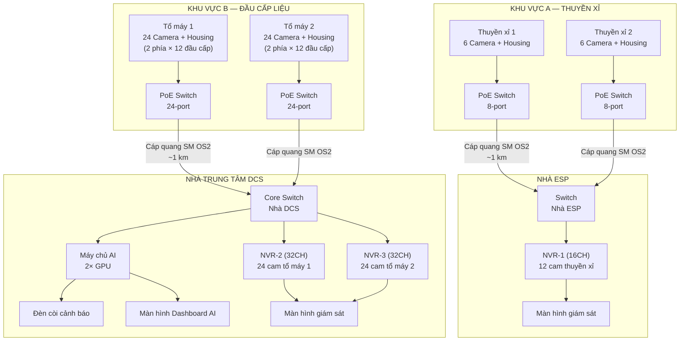
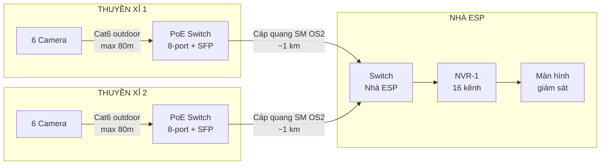
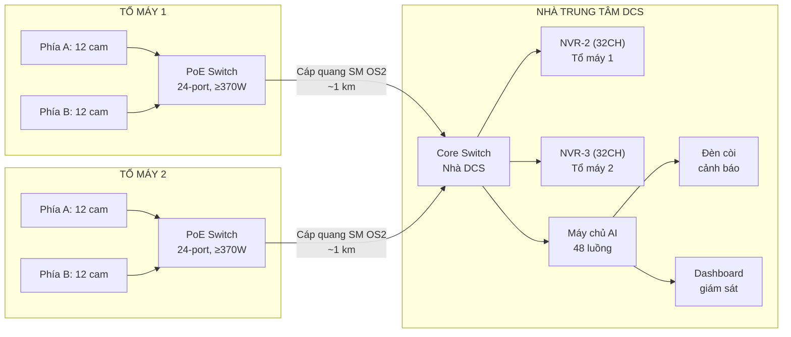

# THUYẾT MINH GIẢI PHÁP KỸ THUẬT
# HỆ THỐNG CAMERA GIÁM SÁT CÔNG NGHIỆP VÀ PHẦN MỀM PHÁT HIỆN CHÁY BẰNG TRÍ TUỆ NHÂN TẠO

**Ngày lập:** 16/03/2026
**Dự án:** Nhà máy Nhiệt điện Thái Bình 2
**Đơn vị đề xuất:** SETCOM / TMTEK

---

## 1. TỔNG QUAN DỰ ÁN

### 1.1 Phạm vi triển khai

Giải pháp bao gồm cung cấp và lắp đặt hệ thống camera giám sát công nghiệp cho **2 khu vực** chính tại Nhà máy Nhiệt điện Thái Bình 2, với tổng cộng **60 camera IP**:

| Khu vực | Mô tả | Số camera | Chức năng | Trung tâm tiếp nhận |
|---|---|---|---|---|
| **A — Thuyền xỉ** | 2 thuyền thải xỉ đáy lò, mỗi thuyền 6 camera | **12** | Giám sát vận hành | **Nhà ESP** |
| **B — Đầu cấp liệu** | 2 tổ máy × 2 phía × 12 đầu cấp liệu | **48** | Giám sát + Phát hiện cháy bằng AI | **Nhà trung tâm DCS** |
| | | **Tổng: 60** | | |

### 1.2 Điều kiện môi trường

| Thông số | Khu vực A (Thuyền xỉ) | Khu vực B (Đầu cấp liệu) |
|---|---|---|
| Nhiệt độ tối đa | ~60°C | ~80°C |
| Môi trường | Bụi, ẩm, nhiệt | Bụi, nhiệt cao, lửa vận hành |
| Giải pháp làm mát | Housing khí nén (đã có sẵn đường cấp khí) | Housing khí nén (đã có sẵn đường cấp khí) |

### 1.3 Yêu cầu chung

- Toàn bộ 60 camera sử dụng **housing làm mát bằng khí nén**, thiết kế và sản xuất tại Việt Nam.
- Ghi hình liên tục tối thiểu **7 ngày** cho toàn bộ hệ thống.
- Truyền dẫn bằng **cáp quang đơn mode** từ hiện trường về trung tâm tiếp nhận (khoảng cách tối đa ~1 km).
- Khoảng cách từ camera đến tủ tập trung tối đa **80 mét**.
- 12 camera khu vực A (thuyền xỉ) truyền tín hiệu về **nhà ESP**.
- 48 camera khu vực B (đầu cấp liệu) truyền tín hiệu về **nhà trung tâm DCS**, nơi đặt máy chủ AI xử lý ảnh phát hiện cháy thời gian thực.
- Cảnh báo cháy bằng **đèn còi** tại nhà trung tâm DCS.

### 1.4 Kiến trúc tổng thể hệ thống

---

## 2. PHẦN A — HỆ THỐNG CAMERA KHU VỰC THUYỀN XỈ

### 2.1 Hiện trạng

Khu vực thuyền xỉ hiện đang sử dụng 12 camera Samsung SCB-2001P (công nghệ analog, đã ngừng sản xuất). Một số camera đã bị hỏng do không chịu được điều kiện nhiệt độ cao (~60°C) tại hiện trường. Tín hiệu analog truyền qua cáp đồng trục BNC cho chất lượng hình ảnh thấp và không có khả năng mở rộng.

Giải pháp đề xuất thay thế toàn bộ 12 camera bằng hệ thống camera IP hiện đại, truyền dẫn qua hạ tầng mạng PoE và cáp quang.

### 2.2 Camera đề xuất — Hikvision DS-2CD2T46G2-4I

| Thông số | Chi tiết |
|---|---|
| Độ phân giải | 4 Megapixel (2688 × 1520) |
| Cảm biến | 1/2.7" Progressive Scan CMOS |
| Ống kính | Tích hợp sẵn — 4mm |
| Chống ngược sáng | 120 dB True WDR |
| Hồng ngoại | 80 mét (EXIR 2.0) |
| Nén hình | H.265+ / H.265 / H.264 |
| Độ nhạy sáng | 0.003 Lux (color) — công nghệ DarkFighter |
| Trí tuệ nhân tạo | AcuSense — phân biệt người / phương tiện |
| Chống bụi/nước | IP67 |
| Nhiệt độ hoạt động | -30°C đến 60°C |
| Vỏ ngoài | Kim loại — phù hợp môi trường công nghiệp |
| Nguồn cấp | PoE (802.3af) — tối đa 12W |
| Lưu trữ cục bộ | Khe microSD đến 512GB |

Model này được lựa chọn vì tính phổ biến cao tại thị trường Việt Nam, dễ dàng thay thế và bảo hành. Ống kính tích hợp sẵn giúp giảm thiểu rủi ro hỏng hóc do bụi và nhiệt. Cùng model được sử dụng cho cả khu vực A và B nhằm thống nhất thiết bị, đơn giản hóa công tác vận hành và bảo trì.

### 2.3 Housing làm mát khí nén

| Thông số | Yêu cầu |
|---|---|
| Thiết kế | Tự thiết kế và sản xuất tại Việt Nam |
| Vật liệu | Inox 304 hoặc nhôm chống ăn mòn |
| Tiêu chuẩn bảo vệ | IP66 trở lên |
| Đầu nối khí nén | Đầu nối nhanh, áp suất làm việc 2–4 bar |
| Kính quan sát | Kính chịu nhiệt, chống bám bụi |
| Yêu cầu làm mát | Giảm nhiệt từ 60°C xuống dưới 55°C |
| Đầu cáp | Cable gland chống nước cho dây LAN và nguồn |
| Số lượng | 12 bộ |

Khí nén sạch được thổi liên tục qua khoang camera, tạo áp suất dương bên trong housing. Giải pháp này đồng thời thực hiện ba chức năng: làm mát camera, ngăn bụi xâm nhập, và giữ sạch kính quan sát.

### 2.4 Hạ tầng mạng và truyền dẫn

Mỗi thuyền xỉ được trang bị một tủ tập trung chứa PoE switch 8-port có cổng SFP uplink. Camera kết nối về switch bằng cáp LAN Cat6 outdoor (chống nước, chịu UV). Từ tủ tập trung, tín hiệu được truyền về **nhà ESP** qua cáp quang đơn mode OS2.

| Thiết bị | Mô tả | SL |
|---|---|---|
| PoE Switch 8-port có SFP uplink | Đặt tại mỗi thuyền xỉ | 2 |
| Module SFP SM 1.25G | Mỗi tuyến quang cần 1 cặp (2 module) | 4 |
| Cáp quang SM OS2 outdoor | 2–4 core, 9/125µm | 2 tuyến |
| ODF + pigtail + patchcord quang | Đầu cuối cáp quang mỗi đầu | 4 bộ |
| Cáp LAN Cat6 outdoor | Từ camera đến switch, trung bình ~50m | 12 đoạn |
| Junction box IP66 | Bảo vệ đầu nối RJ45 tại mỗi camera | 12 |
| Tủ rack mini (outdoor) | Đặt PoE switch, có che chắn bụi và nhiệt | 2 |

### 2.5 Đầu ghi hình và lưu trữ

Sử dụng 1 đầu ghi **Hikvision DS-7616NI-K2** (16 kênh IP, 2 khe SATA, băng thông vào 160 Mbps). Với 12 camera sử dụng và 4 kênh dự phòng cho mở rộng sau này.

**Tính toán lưu trữ — 12 camera × 7 ngày:**

| Thông số | Giá trị |
|---|---|
| Bitrate trung bình (H.265+) | ~2 Mbps / camera |
| Tổng bitrate | 24 Mbps |
| Dung lượng / ngày | ~254 GB |
| Dung lượng 7 ngày | ~1,78 TB |

Ổ cứng đề xuất: **2 × WD Purple 4TB** (WD43PURZ) — tổng 8TB, đủ lưu trữ khoảng 31 ngày liên tục.

### 2.6 Bảng thiết bị và dự toán — Khu vực A

| STT | Thiết bị | SL | Đơn giá (VND) | Thành tiền (VND) |
|---|---|---|---|---|
| 1 | Camera Hikvision DS-2CD2T46G2-4I | 12 | 2.800.000 | 33.600.000 |
| 2 | Housing khí nén (chịu 60°C, sản xuất VN) | 12 | *(tự SX)* | *(tự SX)* |
| 3 | NVR Hikvision DS-7616NI-K2 (16CH) | 1 | 4.500.000 | 4.500.000 |
| 4 | Ổ cứng WD Purple 4TB | 2 | 2.500.000 | 5.000.000 |
| 5 | PoE Switch 8-port (SFP uplink) | 2 | 3.000.000 | 6.000.000 |
| 6 | Module SFP SM 1.25G | 4 | 300.000 | 1.200.000 |
| 7 | Cáp quang SM OS2 outdoor (~1km/tuyến) | 2 tuyến | 4.000.000 | 8.000.000 |
| 8 | ODF + pigtail + patchcord quang | 4 bộ | 500.000 | 2.000.000 |
| 9 | Cáp LAN Cat6 outdoor (tb ~50m/đoạn) | 12 đoạn | 500.000 | 6.000.000 |
| 10 | Junction box IP66 | 12 | 150.000 | 1.800.000 |
| 11 | Ống luồn / máng cáp bảo vệ | 1 bộ | 3.000.000 | 3.000.000 |
| 12 | Tủ rack mini outdoor | 2 | 1.500.000 | 3.000.000 |
| 13 | UPS cho NVR và switch trung tâm | 1 | 3.000.000 | 3.000.000 |
| 14 | Màn hình giám sát 27" | 1 | 3.000.000 | 3.000.000 |
| | | | **Tổng Phần A** | **~80.100.000** |

*Giá tham khảo, chưa bao gồm: housing (tự sản xuất), nhân công lắp đặt, hàn nối cáp quang và vật tư phụ.*

---

## 3. PHẦN B — HỆ THỐNG CAMERA VÀ PHẦN MỀM AI PHÁT HIỆN CHÁY — KHU VỰC ĐẦU CẤP LIỆU

### 3.1 Mô tả khu vực và yêu cầu

Khu vực đầu cấp liệu bao gồm 2 tổ máy, mỗi tổ máy có 2 phía, mỗi phía có 12 đầu cấp liệu sử dụng xi lanh thủy lực. Tổng cộng 48 vị trí cần lắp đặt camera.

Nhiệt độ môi trường tại khu vực này lên đến ~80°C, cao hơn khu vực thuyền xỉ. Toàn bộ camera phải được bảo vệ bằng housing làm mát khí nén với năng lực giảm nhiệt cao hơn.

Ngoài chức năng giám sát, toàn bộ 48 camera cần được đưa về máy chủ trung tâm để xử lý ảnh bằng trí tuệ nhân tạo, phát hiện điểm cháy và ngọn lửa bất thường trong thời gian thực.

| Thông số | Chi tiết |
|---|---|
| Số lượng camera | 48 (2 tổ máy × 2 phía × 12 đầu cấp) |
| Nhiệt độ tối đa | ~80°C |
| Chức năng | Giám sát + Phát hiện cháy bằng AI |
| Hạ tầng tủ | Mỗi tổ máy 1 tủ cho 24 camera (cả 2 phía) |
| Ghi hình | Tối thiểu 7 ngày liên tục |
| Cảnh báo | Đèn còi tại nhà trung tâm DCS |

### 3.2 Camera đề xuất

Sử dụng cùng model **Hikvision DS-2CD2T46G2-4I** như khu vực A. Camera có khả năng nhìn đêm bằng hồng ngoại (EXIR 80 mét). Việc phát hiện cháy được thực hiện bằng phần mềm AI xử lý ảnh trên máy chủ, không sử dụng camera ảnh nhiệt.

### 3.3 Housing làm mát khí nén — Phiên bản chịu nhiệt cao

| Thông số | Yêu cầu |
|---|---|
| Thiết kế | Tự thiết kế và sản xuất tại Việt Nam |
| Vật liệu | Inox 304 hoặc Inox 316 (chống ăn mòn, chịu nhiệt cao) |
| Tiêu chuẩn bảo vệ | IP66 trở lên |
| Yêu cầu làm mát | Giảm nhiệt từ 80°C xuống dưới 55°C |
| Kính quan sát | Kính chịu nhiệt cao, chống bám muội |
| Số lượng | 48 bộ |

Do nhiệt độ môi trường cao hơn khu vực A, housing phiên bản này cần thiết kế với lưu lượng khí lớn hơn. Có thể cần tăng đường kính ống dẫn khí hoặc bổ sung thêm lớp cách nhiệt bên trong để đảm bảo nhiệt độ bên trong khoang camera luôn dưới ngưỡng cho phép của thiết bị.

### 3.4 Hạ tầng mạng và truyền dẫn

Mỗi tổ máy được trang bị một tủ tập trung chứa PoE switch 24-port (công suất PoE tối thiểu 370W) có cổng SFP uplink. Toàn bộ 24 camera từ cả 2 phía của một tổ máy đều tập trung về cùng một tủ, sau đó đẩy cáp quang về **nhà trung tâm DCS**.

| Thiết bị | Mô tả | SL |
|---|---|---|
| PoE Switch 24-port (SFP uplink, ≥370W) | Đặt tại mỗi tổ máy, cấp nguồn cho 24 camera | 2 |
| Module SFP SM 1.25G | Mỗi tuyến quang cần 1 cặp | 4 |
| Cáp quang SM OS2 outdoor | 2 tuyến từ tổ máy về trung tâm | 2 tuyến |
| ODF + pigtail + patchcord quang | Đầu cuối cáp quang | 4 bộ |
| Cáp LAN Cat6 outdoor | Từ camera đến switch, tối đa 80m | 48 đoạn |
| Junction box IP66 | Bảo vệ đầu nối RJ45 tại camera | 48 |
| Tủ rack công nghiệp | Đặt switch, vị trí tránh nguồn nhiệt | 2 |

### 3.5 Đầu ghi hình và lưu trữ

Sử dụng **2 × Hikvision DS-7632NI-K2** (32 kênh IP, 2 khe SATA, băng thông vào 256 Mbps). Mỗi đầu ghi phụ trách 24 camera của một tổ máy.

**Tính toán lưu trữ — 48 camera × 7 ngày:**

| Thông số | Mỗi NVR (24 cam) | Tổng (48 cam) |
|---|---|---|
| Tổng bitrate (H.265+) | 48 Mbps | 96 Mbps |
| Dung lượng / ngày | ~507 GB | ~1.014 TB |
| Dung lượng 7 ngày | ~3,5 TB | ~7,1 TB |

Ổ cứng mỗi NVR: **2 × WD Purple 4TB** — tổng 8TB, đủ lưu trữ khoảng 16 ngày liên tục.
Tổng ổ cứng khu vực B: **4 × WD Purple 4TB**.

### 3.6 Máy chủ xử lý ảnh AI

Máy chủ đảm nhận việc nhận luồng video từ 48 camera đồng thời, chạy mô hình AI phát hiện cháy trong thời gian thực, và quản lý hệ thống cảnh báo.

**Yêu cầu xử lý:**

| Thông số | Giá trị |
|---|---|
| Số luồng camera | 48 luồng đồng thời |
| Độ phân giải | 4MP (2688 × 1520) |
| Tốc độ xử lý | Tối thiểu 5 fps / camera |
| Mô hình AI | Tự huấn luyện trên dữ liệu thực tế nhà máy |

**Cấu hình đề xuất:**

| Thành phần | Cấu hình |
|---|---|
| CPU | Intel Xeon Silver 4314 (16C/32T) hoặc tương đương |
| RAM | 128 GB ECC DDR4 |
| GPU | 2 × NVIDIA RTX 4090 (24GB VRAM) hoặc 2 × NVIDIA A4000 |
| Ổ hệ thống | 2 × 480GB SSD (RAID 1) |
| Ổ dữ liệu | 2 × 2TB NVMe SSD (buffer AI + lưu trữ sự cố) |
| Mạng | 10GbE hoặc 2 × 1GbE bonding |
| Nguồn | PSU 1200W+ (redundant) |
| Hệ điều hành | Ubuntu Server 22.04 LTS hoặc Windows Server 2022 |

Với 2 GPU, hệ thống có khả năng xử lý 48 luồng camera ở tốc độ 5–10 fps sử dụng mô hình phát hiện lửa dựa trên kiến trúc YOLO. Mỗi GPU đảm nhận khoảng 24 luồng.

### 3.7 Phần mềm phát hiện cháy bằng trí tuệ nhân tạo

Phần mềm được phát triển nội bộ, sử dụng mô hình AI huấn luyện trên dữ liệu thực tế thu thập tại nhà máy. Dưới đây là các tính năng chính của hệ thống:

#### 3.7.1 Phát hiện điểm cháy thời gian thực

Hệ thống giám sát liên tục 48 luồng camera, nhận diện ngọn lửa bất thường và phát cảnh báo trong vòng 3 giây. Mô hình AI được huấn luyện chuyên biệt cho môi trường đốt than công nghiệp, cho phép phân biệt giữa:
- Ánh sáng phản chiếu, tia lửa do quá trình cấp liệu (hiện tượng bình thường trong vận hành)
- Cháy bất thường cần can thiệp

Khả năng nhận diện ngữ cảnh vận hành này giúp **giảm thiểu đáng kể tỷ lệ báo động giả** — vốn là hạn chế lớn nhất của các giải pháp phát hiện cháy thông thường.

#### 3.7.2 Phân tích tương quan đa camera

Khác với các camera phát hiện cháy độc lập (mỗi camera hoạt động riêng lẻ), hệ thống này phân tích **đồng thời tín hiệu từ nhiều camera** để:

- Xác nhận chéo sự kiện cháy từ nhiều góc quan sát, nâng cao độ tin cậy
- Phát hiện hướng lan truyền lửa giữa các đầu cấp liệu
- Tự động mở rộng giám sát sang các camera lân cận khi phát hiện ngọn lửa

#### 3.7.3 Bản đồ rủi ro cháy thời gian thực

Dashboard hiển thị sơ đồ tổng quan toàn bộ 48 đầu cấp liệu với mã màu theo mức độ rủi ro (xanh — vàng — cam — đỏ), cập nhật liên tục. Vận hành viên có thể nắm bắt tình trạng tổng quan của hệ thống chỉ trong một cái nhìn.

#### 3.7.4 Cảnh báo đa cấp

Hệ thống phân chia cảnh báo thành 3 cấp độ nhằm tránh tình trạng "mệt mỏi báo động" cho vận hành viên:

| Cấp độ | Điều kiện kích hoạt | Hành động |
|---|---|---|
| **Cấp 1 — Theo dõi** | Phát hiện bất thường nhẹ từ 1 camera, độ tin cậy thấp | Hiển thị cảnh báo vàng trên dashboard |
| **Cấp 2 — Cảnh báo** | Xác nhận từ 1 camera (độ tin cậy cao) hoặc từ 2 camera trở lên | Cảnh báo cam kèm âm thanh |
| **Cấp 3 — Báo động** | Xác nhận cháy từ nhiều camera, có dấu hiệu lan truyền | Đèn còi báo động, popup toàn màn hình |

#### 3.7.5 Dự đoán rủi ro cháy

Ngoài khả năng phát hiện cháy khi xảy ra, hệ thống còn phân tích dữ liệu lịch sử để nhận diện các quy luật và dấu hiệu tiền cháy. Khi phát hiện điều kiện vận hành tương tự các sự cố đã xảy ra trước đó, hệ thống đưa ra cảnh báo phòng ngừa. Tính năng này cho phép hệ thống **cải thiện liên tục** theo thời gian sử dụng.

#### 3.7.6 Lưu trữ bằng chứng sự cố tự động

Khi xảy ra sự kiện cháy, hệ thống tự động:
- Cắt và lưu video 5 phút trước, trong và sau sự kiện từ tất cả camera liên quan
- Tạo báo cáo sự cố kèm ảnh chụp, video clip, thời gian và vị trí
- Lưu trữ dài hạn trong cơ sở dữ liệu có thể tra cứu, phục vụ công tác điều tra và cải tiến quy trình vận hành

#### 3.7.7 Báo cáo phân tích xu hướng

Hệ thống tự động tổng hợp báo cáo định kỳ (tuần / tháng) bao gồm:
- Thống kê số lần cảnh báo và báo động theo thời gian
- Xếp hạng các đầu cấp liệu theo mức độ rủi ro
- Phân tích xu hướng cải thiện hoặc suy giảm an toàn

Dữ liệu này hỗ trợ ban vận hành trong việc ra quyết định bảo trì phòng ngừa và tối ưu hóa quy trình.

#### 3.7.8 Dashboard giám sát trung tâm

Giao diện web hiển thị trên màn hình chuyên dụng tại phòng điều khiển, bao gồm:
- Video trực tiếp 48 camera với lớp phủ AI (khoanh vùng ngọn lửa phát hiện được)
- Bản đồ rủi ro cháy tổng quan
- Lịch sử sự kiện và thống kê
- Trạng thái hoạt động của hệ thống (camera online/offline, mức sử dụng GPU)

#### 3.7.9 Giao diện lập trình tích hợp (API)

Hệ thống cung cấp API dạng RESTful cho phép tích hợp với hệ thống DCS/SCADA hiện có của nhà máy, phần mềm quản lý vận hành, hoặc ứng dụng thông báo từ xa trên điện thoại (tùy chọn mở rộng).

### 3.8 Hệ thống cảnh báo tại phòng điều khiển

| Thiết bị | Mô tả | SL |
|---|---|---|
| Đèn cảnh báo đa màu (beacon) | LED xanh/vàng/đỏ, gắn tại phòng điều khiển | 1 |
| Còi báo động | Còi điện 85dB+, kích hoạt khi cảnh báo cấp 3 | 1 |
| Bộ relay điều khiển | Nhận tín hiệu từ máy chủ AI, kích hoạt đèn/còi | 1 |
| Màn hình Dashboard AI | 32"–43" 4K, hiển thị dashboard AI chuyên dụng | 1 |
| Màn hình NVR | 27", hiển thị camera trực tiếp từ NVR | 2 |

### 3.9 Bảng thiết bị và dự toán — Khu vực B

**Camera và ghi hình:**

| STT | Thiết bị | SL | Đơn giá (VND) | Thành tiền (VND) |
|---|---|---|---|---|
| 1 | Camera Hikvision DS-2CD2T46G2-4I | 48 | 2.800.000 | 134.400.000 |
| 2 | Housing khí nén (chịu 80°C, sản xuất VN) | 48 | *(tự SX)* | *(tự SX)* |
| 3 | NVR Hikvision DS-7632NI-K2 (32CH) | 2 | 6.500.000 | 13.000.000 |
| 4 | Ổ cứng WD Purple 4TB | 4 | 2.500.000 | 10.000.000 |

**Hạ tầng mạng:**

| STT | Thiết bị | SL | Đơn giá (VND) | Thành tiền (VND) |
|---|---|---|---|---|
| 5 | PoE Switch 24-port (SFP, ≥370W PoE) | 2 | 8.000.000 | 16.000.000 |
| 6 | Module SFP SM 1.25G | 4 | 300.000 | 1.200.000 |
| 7 | Cáp quang SM OS2 outdoor (~1km/tuyến) | 2 tuyến | 4.000.000 | 8.000.000 |
| 8 | ODF + pigtail + patchcord quang | 4 bộ | 500.000 | 2.000.000 |
| 9 | Cáp LAN Cat6 outdoor (tb ~50m/đoạn) | 48 đoạn | 500.000 | 24.000.000 |
| 10 | Junction box IP66 | 48 | 150.000 | 7.200.000 |
| 11 | Ống luồn / máng cáp bảo vệ | 1 bộ | 10.000.000 | 10.000.000 |
| 12 | Tủ rack công nghiệp | 2 | 2.000.000 | 4.000.000 |

**Máy chủ AI và cảnh báo:**

| STT | Thiết bị | SL | Đơn giá (VND) | Thành tiền (VND) |
|---|---|---|---|---|
| 13 | Máy chủ AI (Xeon + 128GB + 2×GPU) | 1 | 120.000.000 | 120.000.000 |
| 14 | Đèn cảnh báo + Còi + Relay | 1 bộ | 5.000.000 | 5.000.000 |
| 15 | Màn hình Dashboard AI 43" 4K | 1 | 8.000.000 | 8.000.000 |
| 16 | Màn hình NVR 27" | 2 | 3.000.000 | 6.000.000 |
| 17 | UPS 3kVA (cho NVR + Server + Switch) | 1 | 15.000.000 | 15.000.000 |
| | | | **Tổng Phần B** | **~383.800.000** |

*Giá tham khảo, chưa bao gồm: housing (tự sản xuất), phần mềm AI (tự phát triển), nhân công lắp đặt và hàn nối cáp quang.*

---

## 4. HẠ TẦNG TẠI CÁC TRUNG TÂM TIẾP NHẬN

Hệ thống có 2 trung tâm tiếp nhận riêng biệt:

**Tại nhà ESP** (tiếp nhận 12 camera thuyền xỉ):

| STT | Thiết bị | Mô tả | SL | Đơn giá (VND) | Thành tiền (VND) |
|---|---|---|---|---|---|
| 1 | Switch Managed (2+ SFP + RJ45) | Nhận 2 tuyến quang từ thuyền xỉ, phân phối cho NVR-1 | 1 | 3.000.000 | 3.000.000 |

**Tại nhà trung tâm DCS** (tiếp nhận 48 camera đầu cấp liệu + máy chủ AI):

| STT | Thiết bị | Mô tả | SL | Đơn giá (VND) | Thành tiền (VND) |
|---|---|---|---|---|---|
| 2 | Core Switch Managed (2+ SFP + RJ45) | Nhận 2 tuyến quang từ tổ máy, phân phối cho NVR và Server | 1 | 5.000.000 | 5.000.000 |

---

## 5. TỔNG HỢP DỰ TOÁN THIẾT BỊ

| Phần | Mô tả | Thành tiền (VND) |
|---|---|---|
| **Phần A** | Camera giám sát khu vực thuyền xỉ — về nhà ESP (12 camera) | ~80.100.000 |
| **Phần B** | Camera + AI phát hiện cháy khu vực đầu cấp liệu — về nhà DCS (48 camera) | ~383.800.000 |
| **Phần C** | Hạ tầng tại nhà ESP và nhà DCS | ~8.000.000 |
| | **TỔNG CỘNG THIẾT BỊ** | **~471.900.000** |

**Chưa bao gồm trong dự toán trên:**
- Housing làm mát khí nén (60 bộ) — tự thiết kế và sản xuất
- Phần mềm AI phát hiện cháy — tự phát triển
- Nhân công lắp đặt, hàn nối cáp quang, thi công ống luồn
- Vật tư phụ, ống nối khí nén từ điểm cấp khí đến housing
- Chi phí khảo sát hiện trường
- VAT

---

## 6. HƯỚNG DẪN LẮP ĐẶT

### 6.1 Quy định chung

- Toàn bộ camera phải được lắp trong housing làm mát khí nén. Nối ống khí nén từ điểm cấp khí hiện có đến từng housing.
- Sử dụng cáp LAN Cat6 outdoor (bọc PE chống nước, chịu UV) cho đoạn camera đến switch.
- Sử dụng ống ruột gà hoặc máng cáp kim loại bảo vệ cáp trong khu vực công nghiệp.
- Lắp junction box IP66 tại mỗi đầu camera.
- Hàn nối cáp quang cần thợ chuyên dụng, kết thúc bằng ODF tại cả 2 đầu.

### 6.2 Khu vực A — Thuyền xỉ

- PoE switch đặt trong tủ rack mini tại mỗi thuyền, có che chắn bụi và nhiệt.
- Kiểm tra hướng khí nén làm mát trùng với vị trí lắp camera mới.

### 6.3 Khu vực B — Đầu cấp liệu

- Housing phiên bản chịu 80°C — cần kiểm tra lưu lượng khí nén đủ công suất làm mát.
- Tủ switch đặt vị trí có nhiệt độ thấp hơn, tránh gần lò.
- Máy chủ AI đặt tại phòng máy chủ nhà DCS có điều hòa.
- Kiểm tra băng thông mạng từ switch đến server đủ cho 24 luồng 4MP đồng thời.

### 6.4 Nhà ESP

- Lắp UPS cho NVR-1 và switch.
- Màn hình giám sát đặt vị trí dễ quan sát cho vận hành viên.

### 6.5 Nhà trung tâm DCS

- Lắp UPS cho NVR-2, NVR-3, core switch và máy chủ AI.
- Core switch cấu hình VLAN phân tách lưu lượng nếu cần.
- Màn hình Dashboard AI đặt vị trí dễ quan sát cho vận hành viên.
- Đèn còi cảnh báo đặt vị trí dễ nhìn và dễ nghe.

---

*Tài liệu này mang tính đề xuất giải pháp kỹ thuật. Chi phí cụ thể sẽ được xác định sau khi khảo sát hiện trường và nhận báo giá chính thức từ nhà cung cấp.*
